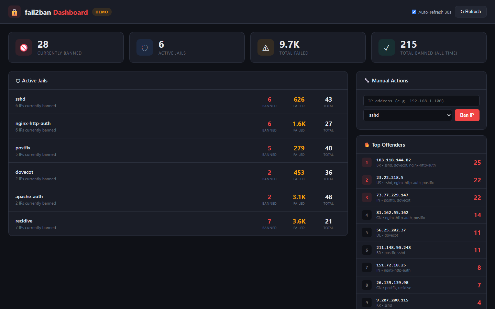
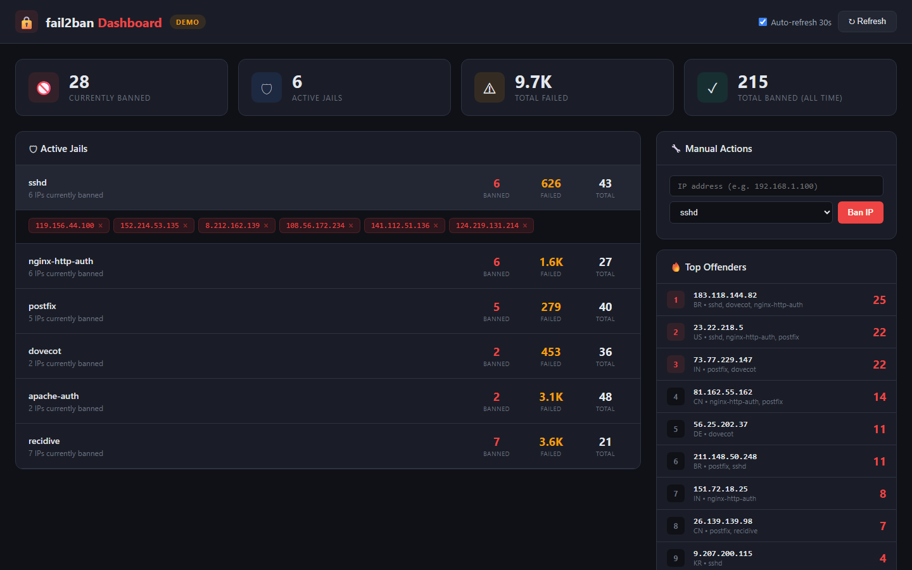

# fail2ban Web Dashboard — Enhanced by KCCS

> A self-hosted security monitoring dashboard for [fail2ban](https://github.com/fail2ban/fail2ban) with real-time jail stats, ban timeline, one-click unban, and remote SSH monitoring.



## What's New in This Fork

- **Web Dashboard** -- See all jails, banned IPs, and attack timelines from your browser
- **One-click ban/unban** -- Manage bans without touching the CLI
- **Top offenders view** -- Most-banned IPs with country codes and affected jails
- **24h ban timeline** -- Visual chart of ban activity over the last 24 hours
- **Remote monitoring** -- Monitor fail2ban on remote servers via SSH
- **Demo mode** -- Works without fail2ban installed for testing and development
- **REST API** -- Full programmatic access to all dashboard data

## Quick Start

### On your Linux server (with fail2ban installed)

```bash
git clone https://github.com/pueblokc/fail2ban.git
cd fail2ban
pip install fastapi "uvicorn[standard]"

python -m uvicorn fail2ban_web.app:app --host 0.0.0.0 --port 8502
# Open http://your-server:8502
```

### Demo mode (no fail2ban needed)

```bash
F2B_DEMO=true python -m uvicorn fail2ban_web.app:app --host 0.0.0.0 --port 8502
# Open http://localhost:8502
```

### Remote monitoring (via SSH)

```bash
F2B_SSH_HOST=192.168.1.100 F2B_SSH_USER=root F2B_SSH_KEY=~/.ssh/id_rsa \
  python -m uvicorn fail2ban_web.app:app --host 0.0.0.0 --port 8502
```

## Screenshots

| Dashboard Overview | Expanded Jail Details |
|:---:|:---:|
|  |  |

## Features

### All Jails at a Glance
See banned count, failed attempts, and totals per jail -- all on one screen with auto-refresh every 30 seconds.

### Expandable Jail Details
Click any jail to see all currently banned IPs with their ban times and metadata.

### One-Click Ban/Unban
Remove bans or add manual bans for any IP in any jail directly from the dashboard. No SSH required.

### Top Offenders
Identify the most-banned IPs across all jails, with country code resolution and affected jail counts.

### 24h Ban Timeline
Visual chart showing ban activity over the last 24 hours. Spot attack patterns at a glance.

### Demo Mode
Auto-detects whether fail2ban is installed. Falls back to realistic demo data for testing and development.

### Remote Monitoring
Monitor fail2ban on any remote server via SSH key authentication. Run the dashboard anywhere, monitor everywhere.

## API Reference

| Method | Endpoint | Description |
|--------|----------|-------------|
| `GET` | `/` | Web Dashboard |
| `GET` | `/api/status` | All jails status + timeline + top offenders |
| `GET` | `/api/jail/{name}` | Specific jail details |
| `POST` | `/api/jail/{name}/ban/{ip}` | Ban an IP in a jail |
| `POST` | `/api/jail/{name}/unban/{ip}` | Unban an IP from a jail |
| `GET` | `/api/log` | Ban/unban action log |
| `GET` | `/api/mode` | Check if running in demo or live mode |

## Environment Variables

| Variable | Default | Description |
|----------|---------|-------------|
| `F2B_PORT` | `8502` | Server port |
| `F2B_DEMO` | `auto` | `auto` / `true` / `false` -- auto-detects fail2ban |
| `F2B_CLIENT` | `fail2ban-client` | Path to fail2ban-client binary |
| `F2B_USE_SUDO` | `true` | Use sudo for fail2ban-client commands |
| `F2B_SSH_HOST` | _(empty)_ | SSH host for remote monitoring |
| `F2B_SSH_USER` | `root` | SSH username |
| `F2B_SSH_KEY` | _(empty)_ | SSH private key path |
| `F2B_DB_PATH` | `./f2b_dashboard.db` | SQLite database for action logs |

## Architecture

```
fail2ban_web/
├── app.py          # FastAPI backend (CLI wrapper + demo mode)
├── __init__.py
└── static/
    └── index.html  # Single-file dark security dashboard
```

The dashboard wraps `fail2ban-client` commands and parses their output. It does NOT modify fail2ban configuration -- only reads status and issues ban/unban commands through the official client.

## Requirements

- Python 3.9+
- `fastapi` and `uvicorn`
- fail2ban installed on the target server (or use demo mode)
- Root/sudo access for fail2ban-client (or SSH access to remote server)

---

## Original Project

<details>
<summary>Click to expand original fail2ban README</summary>

```
                     __      _ _ ___ _
                    / _|__ _(_) |_  ) |__  __ _ _ _
                   |  _/ _` | | |/ /| '_ \/ _` | ' \
                   |_| \__,_|_|_/___|_.__/\__,_|_||_|
                   v1.1.0.dev1            20??/??/??
```

## Fail2Ban: ban hosts that cause multiple authentication errors

Fail2Ban scans log files like `/var/log/auth.log` and bans IP addresses conducting
too many failed login attempts. It does this by updating system firewall rules
to reject new connections from those IP addresses, for a configurable amount
of time. Fail2Ban comes out-of-the-box ready to read many standard log files,
such as those for sshd and Apache, and is easily configured to read any log
file of your choosing, for any error you wish.

Though Fail2Ban is able to reduce the rate of incorrect authentication
attempts, it cannot eliminate the risk presented by weak authentication.
Set up services to use only two factor, or public/private authentication
mechanisms if you really want to protect services.

This README is a quick introduction to Fail2Ban. More documentation, FAQ, and HOWTOs
to be found on fail2ban(1) manpage, [Wiki](https://github.com/fail2ban/fail2ban/wiki),
[Developers documentation](https://fail2ban.readthedocs.io/)
and the website: https://www.fail2ban.org

### Installation

Fail2Ban is likely already packaged for your Linux distribution and [can be installed with a simple command](https://github.com/fail2ban/fail2ban/wiki/How-to-install-fail2ban-packages).

If your distribution is not listed, you can install from GitHub:

Required:
- [Python >= 3.5](https://www.python.org) or [PyPy3](https://pypy.org)
- python-setuptools (or python3-setuptools) for installation from source

To install:

    git clone https://github.com/fail2ban/fail2ban.git
    cd fail2ban
    sudo python setup.py install

### Configuration

You can configure Fail2Ban using the files in `/etc/fail2ban`. It is possible to
configure the server using commands sent to it by `fail2ban-client`. The
available commands are described in the fail2ban-client(1) manpage.

### License

Fail2Ban is free software; you can redistribute it and/or modify it under the
terms of the GNU General Public License as published by the Free Software
Foundation; either version 2 of the License, or (at your option) any later
version.

</details>

---

Developed by **[KCCS](https://kccsonline.com)** | Dashboard by [@pueblokc](https://github.com/pueblokc) | [kccsonline.com](https://kccsonline.com)
